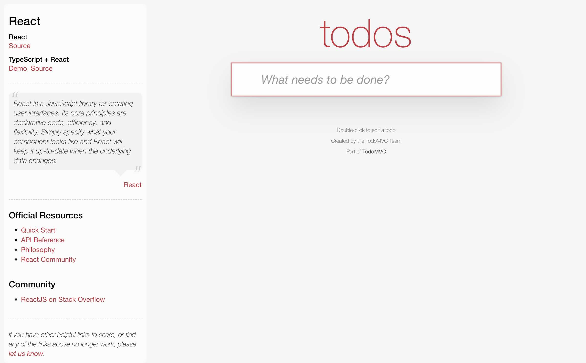
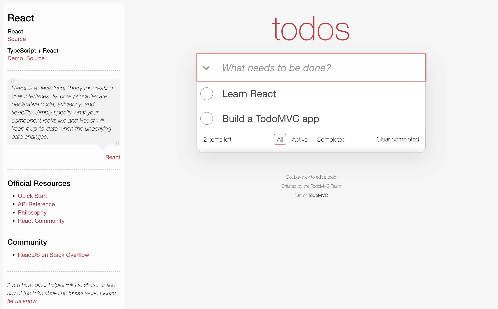
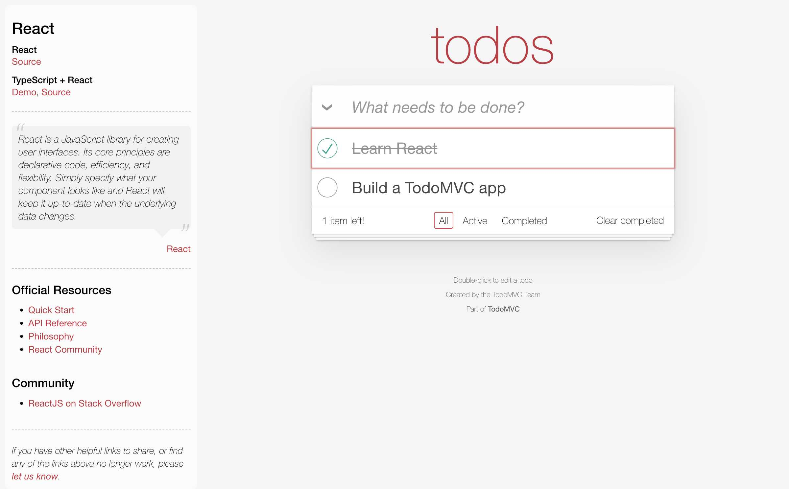
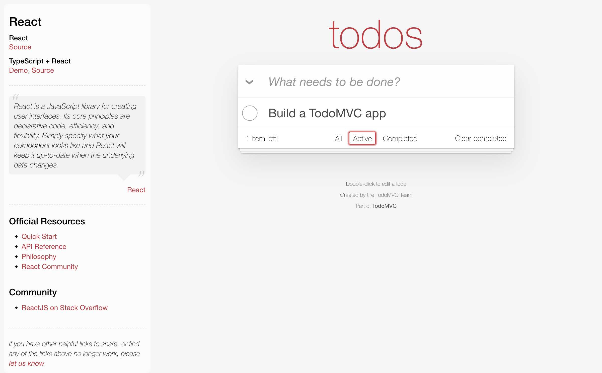
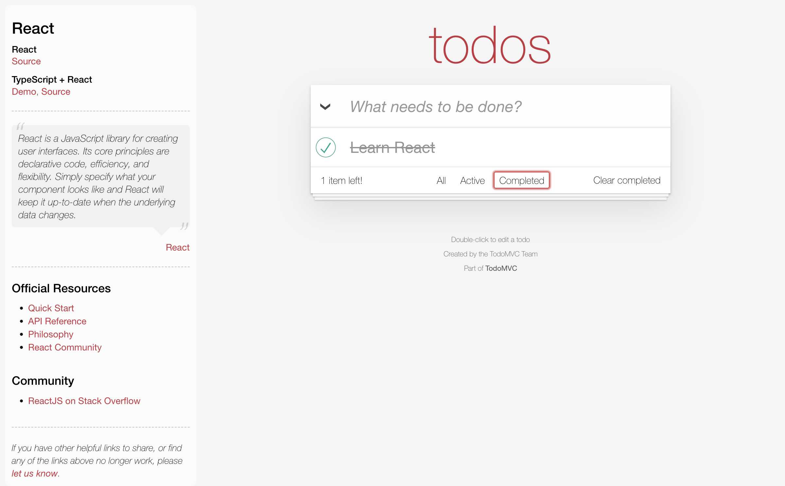

# TodoMVC React 版 紹介マニュアル

## 概要

TodoMVC（Todo Model-View-Controller）は、様々な JavaScript フレームワークで同じ Todo アプリケーションを実装することで、フレームワークの特徴や書き方を比較学習できるプロジェクトです。

- **URL**: https://todomvc.com/examples/react/dist/
- **フレームワーク**: React
- **ソースコード**: https://github.com/tastejs/todomvc/tree/gh-pages/examples/react

## アプリケーション画面

### 初期状態

アプリケーションを開いたときの状態です。左側に React に関する情報、右側に Todo アプリケーションの入力フィールドが表示されています。

## React について

> React is a JavaScript library for creating user interfaces. Its core principles are declarative code, efficiency, and flexibility. Simply specify what your component looks like and React will keep it up-to-date when the underlying data changes.

React は宣言的なコード、効率性、柔軟性を核とする JavaScript ライブラリです。

## 基本機能

### 1. Todo 項目の追加

- 上部の入力フィールドにタスクを入力
- Enter キーで項目を追加
- 追加後は自動的に入力フィールドがクリアされる

Todo 項目を追加すると、リストに表示され、下部に項目数とフィルタボタンが表示されます。

### 2. Todo 項目の管理

- **完了マーク**: 各項目の左側にあるチェックボックスをクリックで完了/未完了を切り替え
- **削除**: 項目の右側にマウスオーバーで「×」ボタンが表示され、クリックで削除
- **編集**: 項目をダブルクリックで編集モードに入る（編集中はテキストフィールドに変化）

タスクを完了すると、テキストに取り消し線が表示され、項目数カウントが更新されます。完了済み項目がある場合、「Clear completed」ボタンが有効になります。

### 3. 一括操作

- **全選択/解除**: 左上の「❯」ボタンで全項目の完了/未完了を一括切り替え（項目がある場合のみ表示）
- **完了済み項目の削除**: 下部の「Clear completed」ボタンで完了済み項目を一括削除

### 4. フィルタリング機能

下部にあるフィルタボタンで表示を切り替え：

- **All**: 全ての項目を表示
- **Active**: 未完了の項目のみ表示
- **Completed**: 完了済みの項目のみ表示

「Active」フィルタを選択すると、未完了のタスクのみが表示されます。現在選択されているフィルタは赤い枠線で強調表示されます。

### 5. 項目数の表示

- 未完了項目の数が「X item(s) left!」として表示
- 完了済み項目がある場合のみ「Clear completed」ボタンが有効化

「Completed」フィルタを選択すると、完了済みのタスクのみが表示されます。完了済みタスクには取り消し線が表示されます。

## UI 構成

### メインエリア

- **ヘッダー**: 「todos」タイトル（薄い文字で大きく表示）
- **入力フィールド**: 新しい Todo を入力するテキストボックス（プレースホルダー「What needs to be done?」）
- **Todo リスト**: 現在の Todo 項目一覧
- **フッター**: 項目数、フィルタボタン、完了済み削除ボタン

### サイドバー

- React 関連のリソースとドキュメントへのリンク
- 公式リソース（Quick Start、API Reference 等）
- コミュニティリソース

## 技術的特徴

### テスト ID

- `text-input`: 新しい Todo 入力フィールド
- `todo-item-toggle`: 各項目の完了/未完了切り替えチェックボックス

### URL ルーティング

- `#/`: 全項目表示
- `#/active`: 未完了項目のみ表示
- `#/completed`: 完了済み項目のみ表示

## 使用方法

1. **新しい Todo の追加**: 入力フィールドにタスクを入力して Enter キーを押す
2. **タスクの完了**: 左側のチェックボックスをクリック
3. **タスクの編集**: 項目をダブルクリックして編集モードに入る
4. **タスクの削除**: 項目の右側にマウスオーバーで「×」ボタンが表示されるのでクリック
5. **フィルタリング**: 下部の All/Active/Completed ボタンで表示を切り替え
6. **一括操作**: 全選択ボタンや「Clear completed」ボタンを使用

## 学習ポイント

TodoMVC React バージョンは以下の学習に適しています：

- React の基本的なコンポーネント構造
- 状態管理（State Management）
- イベントハンドリング
- 条件付きレンダリング
- リストレンダリング
- フォーム処理
- ルーティング（URL 状態管理）

シンプルながら実用的なアプリケーションを通じて、React の核となる概念を理解できる優れた学習リソースです。
